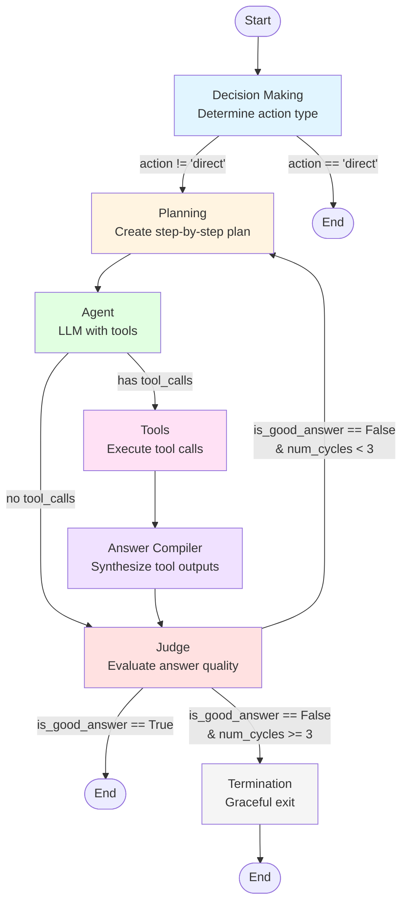

# ClimaDoc AI Agent

ClimaDoc AI is an intelligent AI agent that combines real-time weather intelligence with document-based question answering. Built with LangChain, LangGraph, and Google Gemini, it provides a powerful conversational interface for querying weather data and documents through a single unified agent.

## 🌟 Features

- **🌤️ Real-time Weather Intelligence**: Get current weather conditions and forecasts for any location
- **📄 Document Q&A**: Upload PDF documents and ask questions about their content using RAG (Retrieval-Augmented Generation)
- **💬 Conversational Interface**: Interactive Streamlit chat interface with session-based conversation history
- **🔧 Configurable LLM**: Choose from multiple Google Gemini models (gemini-2.0-flash, gemini-1.5-pro, etc.)
- **🔐 Secure API Key Management**: Input API keys securely through the UI or environment variables
- **📊 Vector Database Integration**: Uses Qdrant for efficient document storage and retrieval
- **🧠 Intelligent Agent Workflow**: Multi-step planning and execution workflow with self-judging capabilities
- **📊 Evaluation**: Evaluating each response.


## 🚀 Quick Start

### Prerequisites

- Python 3.12 or higher
- Google API Key for Gemini models
- OpenWeatherMap API Key (for weather functionality)
- LangSmit API key

### Installation

1. **Clone the repository**
   ```bash
   git clone <repository-url>
   cd ClimaDoc-AI-Agent
   ```

2. **Install dependencies**
   ```bash
   pip install -r requirements.txt
   ```

3. **Set up environment variables** (optional)
   
   Create a `.env` file in the root directory:
   ```env
   GOOGLE_API_KEY=your_google_api_key_here
   OPENWEATHER_API_KEY=your_openweather_api_key_here
   LANGSMITH_API_KEY=your_langsmith api key
   ```

### Running the Application

1. **Start the Streamlit app**
   ```bash
   streamlit run src/climadoc_app.py
   ```

2. **Configure the LLM in the sidebar**
   - Select your preferred Gemini model
   - Enter your Google API key 
   - Click "Initialize LLM"

3. **Upload documents** (optional)
   - Use the sidebar to upload PDF files
   - Click "Process Document" to add them to the vector database

4. **Start chatting!**
   - Ask weather-related questions: "What's the weather in New York?"
   - Ask document-related questions: "What does the document say about..."
   - The agent maintains conversation history throughout your session

## 📖 Usage Guide

### Weather Queries

The agent can answer questions about:
- Current weather conditions
- Weather forecasts
- Temperature, humidity, wind speed
- Weather alerts and warnings

**Example queries:**
- "What's the weather in London?"
- "Tell me the forecast for Tokyo"
- "Is it raining in San Francisco?"

### Document Queries

After uploading PDF documents:
- Ask questions about document content
- Request summaries or explanations
- Extract specific information

**Example queries:**
- "Can you provide Engine specification for Royal Enfield Classic 650 from the User manual?"
- "Summarize the policy document"
- "What does it say about [topic]?"

### Session Management

- **Chat History**: All conversations are maintained during your session
- **Clear History**: Use the "Clear Chat History" button in the sidebar to reset
- **Delete All Records from Qdrant**: Use the "Delete All Records from Qdrant" button in the sidebar to delete the data and embeddings on the Qdrant
- **Session Persistence**: History is cleared when you refresh the page or start a new session


## 🔧 Configuration

### LLM Models

The app supports the following Google Gemini models:
- `gemini-2.0-flash` (default, recommended)

### API Keys

You can provide API keys in these ways:
1. **Streamlit secrets (recommended for deployment)**: Create `.streamlit/secrets.toml`
   ```toml
   GOOGLE_API_KEY = "your_google_api_key"
   OPENWEATHER_API_KEY = "your_openweather_api_key"
   QDRANT_API_KEY = "your_qdrant_api_key"
   LANGSMITH_TRACING="true"
   LANGSMITH_ENDPOINT="https://api.smith.langchain.com"
   LANGSMITH_API_KEY="your_langsmith_api_key"
   ```
2. **Environment variables**: Set `GOOGLE_API_KEY`, `OPENWEATHER_API_KEY`, `LANGSMITH_API_KEY` and `QDRANT_API_KEY`
3. **UI Input**: Enter the Google API key directly in the Streamlit sidebar

### Vector Database

The application uses Qdrant for vector storage. The vector database:
- Automatically creates collections as needed
- Stores document embeddings (768 dimensions)
- Supports similarity search for RAG queries

## 🧠 How It Works

### Agent Workflow

The ClimaDoc agent uses a sophisticated multi-step workflow:

1. **Decision Making**: Determines whether to use weather tools, RAG tools, or provide a direct answer
2. **Planning**: Creates a step-by-step plan to answer the query
3. **Execution**: Executes the plan using available tools
4. **Answer Compilation**: Synthesizes tool outputs into a coherent response
5. **Judging**: Self-evaluates the answer quality using LangSmith
6. **Iteration**: Refines the answer if needed (up to 3 cycles)

### Workflow Diagram

The following diagram illustrates the complete workflow structure and decision points:



### Tools Available

- **`get_weather_info_by_location`**: Fetches real-time weather data
- **`get_context_for_query`**: Retrieves relevant document context using vector search

## 📝 Requirements

See `requirements.txt` for the complete list. Key dependencies include:

- `streamlit` - Web interface
- `langchain` - LLM framework
- `langchain-google-genai` - Google Gemini integration
- `langgraph` - Agent workflow orchestration
- `pypdf` - PDF processing
- `qdrant-client` - Vector database client

## 🐛 Troubleshooting

### LLM Initialization Issues

- Ensure your Google API key is valid
- Check that you have sufficient API quota
- Verify the model name is correct

### Document Processing Errors

- Ensure PDF files are not corrupted
- Check that you have write permissions for temporary files
- Verify Qdrant connection settings

### Weather API Issues

- Verify your OpenWeatherMap API key is set correctly
- Check API quota limits
- Ensure location names are spelled correctly

## 🙏 Acknowledgments

- Built with [LangChain](https://www.langchain.com/)
- Powered by [Google Gemini](https://ai.google.dev/)
- Weather data from [OpenWeatherMap](https://openweathermap.org/)
- Vector storage by [Qdrant](https://qdrant.tech/)
- Evaluation by [LangSmith](https://smith.langchain.com/)

---

**Note**: Make sure to keep your API keys secure and never commit them to version control.
